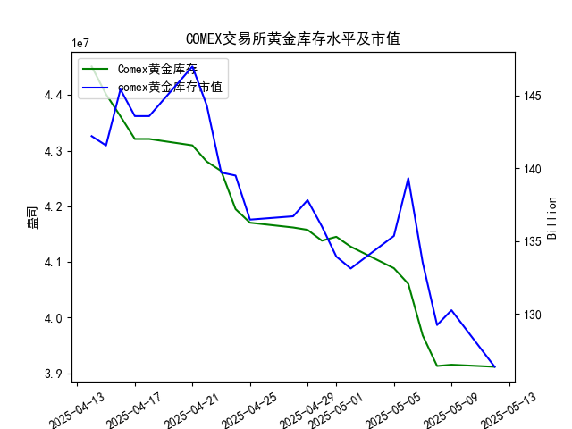

|            |   comex黄金库存量 |   comex黄金库存市值(billion) |   伦敦金现货价 |   上海金交所黄金现货价 |   美元兑人民币汇率 |
|:-----------|------------------:|-----------------------------:|---------------:|-----------------------:|-------------------:|
| 2025-04-15 |       4.40124e+07 |                       3216.5 |        3219.6  |                 762.9  |             7.2096 |
| 2025-04-16 |       4.36175e+07 |                       3334.3 |        3322.9  |                 781.62 |             7.2133 |
| 2025-04-17 |       4.32097e+07 |                       3323.1 |        3305.65 |                 786    |             7.2085 |
| 2025-04-18 |       4.32097e+07 |                       3323.1 |        3305.65 |                 788.62 |             7.2069 |
| 2025-04-21 |       4.30949e+07 |                       3411.1 |        3305.65 |                 804.11 |             7.2055 |
| 2025-04-22 |       4.28033e+07 |                       3371.6 |        3433.55 |                 825.8  |             7.2074 |
| 2025-04-23 |       4.26341e+07 |                       3276.9 |        3262.95 |                 786.99 |             7.2116 |
| 2025-04-24 |       4.19499e+07 |                       3325.5 |        3314.75 |                 792.47 |             7.2098 |
| 2025-04-25 |       4.17059e+07 |                       3272.2 |        3277.3  |                 785.6  |             7.2066 |
| 2025-04-28 |       4.16197e+07 |                       3284.5 |        3296.3  |                 778.4  |             7.2043 |
| 2025-04-29 |       4.15776e+07 |                       3314.5 |        3305.05 |                 780.05 |             7.2029 |
| 2025-04-30 |       4.13831e+07 |                       3286.4 |        3302.05 |                 780.19 |             7.2014 |
| 2025-05-01 |       4.1453e+07  |                       3231   |        3214.75 |                 780.19 |             7.2014 |
| 2025-05-02 |       4.12755e+07 |                       3225   |        3249.7  |                 780.19 |             7.2014 |
| 2025-05-05 |       4.08886e+07 |                       3310.1 |        3249.7  |                 780.19 |             7.2014 |
| 2025-05-06 |       4.06075e+07 |                       3430.9 |        3391.45 |                 792.2  |             7.2008 |
| 2025-05-07 |       3.96819e+07 |                       3364.7 |        3392.25 |                 798.51 |             7.2005 |
| 2025-05-08 |       3.91313e+07 |                       3302.1 |        3352.3  |                 786.5  |             7.2073 |
| 2025-05-09 |       3.91541e+07 |                       3326.3 |        3324.55 |                 785.5  |             7.2095 |
| 2025-05-12 |       3.91172e+07 |                       3230   |        3235.4  |                 759    |             7.2066 |

### 近期黄金市场数据分析与投资机会判断

#### 一、核心结论
1. **COMEX库存与价格的短期背离**：尽管研究员认为库存与价格正相关，但**最近一周数据出现明显背离**（库存下降伴随金价暴跌），需警惕短期波动风险。
2. **跨市场套利窗口**：今日（2025-05-12）上海金价对伦敦金价存在**异常溢价**（溢价约9元/克），存在跨市场套利机会。
3. **人民币计价黄金超跌**：上海金价今日单日暴跌3.4%，远超伦敦金价跌幅（2.7%），结合人民币汇率稳定，可能存在超跌反弹机会。

---

#### 二、关键数据变化（最近一周）
| 日期       | COMEX库存（万吨） | 伦敦金价（美元/盎司） | 上海金价（元/克） | 汇率（USD/CNY） |
|------------|-------------------|-----------------------|-------------------|-----------------|
| **2025-05-08** | 391.3             | 3352.30               | 786.50            | 7.2073          |
| **2025-05-09** | 391.5             | 3324.55 ▼2.3%         | 785.50 ▼0.1%      | 7.2095          |
| **2025-05-12** | 391.1 ▼0.1%       | 3235.40 ▼7.0%         | 759.00 ▼3.4%      | 7.2066 ▼0.04%   |

---

#### 三、投资机会分析

##### 1. **跨市场套利机会**
- **溢价验证**：  
  今日伦敦金价换算为人民币价格 ≈ **750元/克**（3235.40美元 × 7.2066汇率 ÷ 31.1035克/盎司），而上海金价为**759元/克**，溢价达**1.2%**。
- **操作建议**：  
  通过同时买入伦敦金（做多）和卖出上海金（做空），锁定无风险套利空间。

##### 2. **超跌反弹机会**
- **上海金价异常波动**：  
  今日上海金价单日跌幅（3.4%）显著高于伦敦市场（2.7%），且人民币汇率保持稳定，反映**国内恐慌性抛售**可能过度。
- **支撑位判断**：  
  上海金价关键支撑位在750元/克（近3个月波动中位数），当前价格已接近超卖区间。

##### 3. **库存-价格背离的警示**
- **短期背离信号**：  
  COMEX库存连续6周下降（累计降幅12.1%），但伦敦金价本周下跌7.0%，打破长期正相关性。
- **风险提示**：  
  需警惕市场对美联储加息预期或地缘风险缓和的定价，建议通过期权对冲短期下行风险。

---

#### 四、操作优先级排序
1. **套利策略**（低风险）：立即执行跨市场套利。
2. **反弹策略**（中风险）：轻仓布局上海金超跌反弹，止损位750元/克。
3. **趋势策略**（高风险）：暂缓单边做多黄金，等待库存-价格关系修复信号。

---

#### 五、关键日期监控
- **2025-05-13**：观察上海金交所开盘后溢价是否收敛。
- **2025-05-15**：关注COMEX库存周度数据是否延续下降趋势。
- **2025-05-16**：美联储议息会议可能引发汇率波动，影响套利空间。